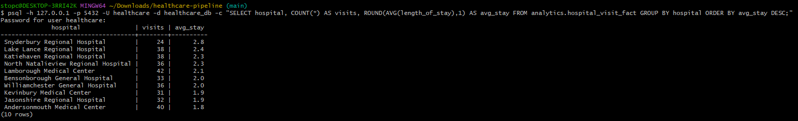
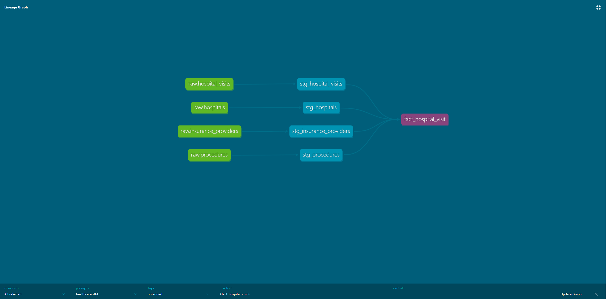

# Healthcare Data Pipeline — Oracle to Cloud Warehouse Migration

A healthcare data pipeline that migrates a normalized OLTP schema (originally
designed against Oracle) into a **RAW → STAGING → ANALYTICS** layered
warehouse, following the same architecture pattern used in production
Snowflake environments — built and run on **Postgres + Docker** for a
free, fully local development environment.

```
Source (Oracle-style, 3NF)
        │
        ▼
   RAW schema           ← untouched, loosely typed, mirrors source 1:1
        │
        ▼
   STAGING schema        ← typed, constrained, deduplicated, cleaned
        │
        ▼
   ANALYTICS schema        ← star schema: fact tables + conformed dimensions
```

## Why Postgres instead of Snowflake

This was originally designed as a Snowflake migration (see `snowflake/` for
the original DDL, written to Snowflake's SQL dialect). Snowflake's only
free option is a 30-day trial, which isn't a great fit for an ongoing
portfolio project meant to be re-run and iterated on indefinitely. Postgres
is a genuine client-server SQL database (unlike an embedded engine like
DuckDB), has first-class support in every tool downstream of this project —
dbt, Airflow, Spark's JDBC driver — and containerizes in one command. The
warehouse-specific pieces that don't carry over cleanly (micro-partitions,
`CLUSTER BY`, decoupled compute/storage billing) are called out explicitly
in the code rather than glossed over.

## Source schema

Two source ER diagrams drove this project: a normalized OLTP schema
(patients, hospitals, doctors, prescriptions, hospital visits, insurance)
and a target dimensional model (two fact tables — `PRESCRIPTION_FACT` and
`HOSPITAL_VISIT_FACT` — surrounded by conformed dimensions, including a
Julian date dimension). See `docs/erd/` for both diagrams.

## Quickstart

Requires [Docker Desktop](https://www.docker.com/products/docker-desktop/).

```bash
# 1. Start Postgres + Adminer (web UI at localhost:8080)
docker compose up -d

# 2. Build the schema (run in order)
psql -h 127.0.0.1 -p 5432 -U healthcare -d healthcare_db -f sql/00_setup_schemas.sql
psql -h 127.0.0.1 -p 5432 -U healthcare -d healthcare_db -f sql/01_raw_tables.sql
psql -h 127.0.0.1 -p 5432 -U healthcare -d healthcare_db -f sql/02_staging_tables.sql
psql -h 127.0.0.1 -p 5432 -U healthcare -d healthcare_db -f sql/03_analytics_tables.sql

# 3. Generate + load synthetic data (no real patient data was ever
#    available for this project — see "Data" below)
python3 data/generate_synthetic_data.py
psql -h 127.0.0.1 -p 5432 -U healthcare -d healthcare_db -f load_synthetic_data.sql

# 4. Re-run the transforms now that raw has data
psql -h 127.0.0.1 -p 5432 -U healthcare -d healthcare_db -f sql/02_staging_tables.sql
psql -h 127.0.0.1 -p 5432 -U healthcare -d healthcare_db -f sql/03_analytics_tables.sql

# 5. Validate
psql -h 127.0.0.1 -p 5432 -U healthcare -d healthcare_db -f sql/04_validate_migration.sql
```

Credentials (dev-only, safe to keep public): user `healthcare`, password
`healthcare`, database `healthcare_db`.

### Optional: dbt transformation layer

Steps 2 and 4 above (`sql/02_staging_tables.sql`, `sql/03_analytics_tables.sql`)
can be replaced entirely with the dbt project in `dbt/` — same transforms,
now with tests, documentation, and lineage. See `dbt/README.md` for full
setup, but in short:

```bash
pip install dbt-core dbt-postgres
mkdir -p ~/.dbt && cp dbt/profiles.yml.sample ~/.dbt/profiles.yml
cd dbt/healthcare_dbt
dbt run             # builds all staging views + mart tables
dbt test            # 60 tests: unique, not_null, relationships, accepted_values
dbt docs generate && dbt docs serve --port 8081
```

## Data

No production/real dataset was available for this project (the original
Oracle instance wasn't accessible). `data/generate_synthetic_data.py`
produces a deterministic (seeded) synthetic dataset instead: 250 patients,
350 hospital visits, 600 prescriptions, plus supporting reference data
(hospitals, doctors, medications, procedures, insurance providers,
geography). Referential integrity is enforced at generation time — every
prescription references a real patient/doctor/medication, every visit falls
within realistic date ranges, etc.

## Validated results

After a full run, row counts match exactly across all three layers with
zero data loss:

| Table | raw | staging | analytics |
|---|---|---|---|
| patients | 250 | 250 | 250 (`patient_dim`) |
| hospital_visits | 350 | 350 | 350 (`hospital_visit_fact`) |
| prescriptions | 600 | 600 | 600 (`prescription_fact`) |

`analytics.julian_date_dim` generates 7,305 rows (20 years of calendar
dates, 2010–2029) independent of source data volume.

## Sample queries

See `sql/05_sample_queries.sql` for the full set (10 queries). A couple of
examples:

**Average length of stay by hospital**
```sql
SELECT
    hospital,
    COUNT(*)                      AS total_visits,
    ROUND(AVG(length_of_stay), 1) AS avg_length_of_stay_days
FROM analytics.hospital_visit_fact
GROUP BY hospital
ORDER BY avg_length_of_stay_days DESC;
```

**Monthly admission trend, using the date dimension**
```sql
SELECT
    d.year_num, d.month_num, d.month_name,
    COUNT(*) AS admissions
FROM analytics.hospital_visit_fact hv
JOIN analytics.julian_date_dim d ON hv.admission_date = d.julian_day
GROUP BY d.year_num, d.month_num, d.month_name
ORDER BY d.year_num, d.month_num;
```



## dbt transformation layer

The `dbt/` folder reimplements the staging and analytics layers as a dbt
project: 12 staging models (one per raw table) and 7 mart models (`dim_date`,
`dim_patient`, `dim_doctor`, `dim_medication`, `dim_procedure`,
`fact_prescription`, `fact_hospital_visit`), all connected via `ref()`/
`source()` so dbt can build the full dependency graph automatically.

**60/60 tests pass** — every primary key is checked `unique`/`not_null`,
and every foreign key in a fact table is checked with a `relationships`
test against its dimension. This is the automated version of the
column-width bug documented below: with these tests in place, that bug
would have failed loudly and specifically instead of silently producing
empty downstream tables.

`dbt docs generate && dbt docs serve` renders an interactive, searchable
lineage graph for the whole project. Example — `fact_hospital_visit` traced
back through its four staging models to their raw sources:



See `dbt/README.md` for full setup and details on what each test checks.

## Airflow orchestration

The `dags/healthcare_pipeline_dag.py` DAG chains the whole pipeline into
one scheduled, monitored run: `generate_synthetic_data → load_raw_data →
dbt_run → dbt_test → validate_migration`. Runs in Airflow's `standalone`
mode (single container, SQLite metadata DB) via a custom image
(`Dockerfile.airflow`) with `psql`, `dbt-core`, and `dbt-postgres` baked
in on top of the official Airflow image.

```bash
docker compose up -d --build   # first run builds the custom image, takes a few minutes
```

Web UI at `http://localhost:8083` (admin credentials are auto-generated
and printed in `docker logs healthcare_airflow` on first boot).

Every task passed end to end on a full run: `dbt_run` built all 19 models,
`dbt_test` passed all 60 tests, `validate_migration` confirmed matching
row counts across raw/staging/analytics — all orchestrated, not run by
hand. See `AIRFLOW_README.md` for full setup and a note on why this uses
`standalone`/`SequentialExecutor` rather than a full `CeleryExecutor`
production setup.

## Challenges encountered (and how they were resolved)

Documenting these because working through them was most of the actual
engineering effort:

- **Port 5432 conflict.** Two pre-existing native Windows PostgreSQL
  services (versions 17 and 18) were already bound to port 5432, silently
  intercepting every connection attempt from the host machine, while
  container-to-container tools (Adminer) worked fine because they never
  touched the host network stack. Diagnosed with `netstat -ano | findstr
  5432`, confirmed via `Get-Service *postgres*`, resolved by stopping both
  native services and setting them to manual startup.
- **Cascading FK failures from a column-width bug.** `staging.hospitals`,
  `staging.doctors`, and `staging.insurance_providers` all failed to load
  with `value too long for type character varying(20)` — synthetic phone
  numbers with extensions exceeded the column width. Because
  `staging.prescriptions` and `staging.hospital_visits` have foreign keys
  into `doctors`, their inserts failed too, even though the actual error was
  three tables upstream. Root-caused via the Postgres error output rather
  than assuming the immediately-failing table was the actual problem;
  fixed by widening the affected columns.
- **Silent partial script execution.** A GUI SQL editor was running only
  the selected/highlighted statement rather than the full pasted script,
  producing tables that *looked* successfully created but were missing
  their transform data — row counts of 0 with no error shown. Caught by
  cross-checking row counts against `information_schema.tables` rather
  than trusting "no error" as confirmation of success; resolved by running
  full scripts via `psql -f` instead, which doesn't have this ambiguity.
- **Missing dependency in the custom Airflow image.** `Dockerfile.airflow`
  originally installed `dbt-core`/`dbt-postgres` but not `faker`, which
  `generate_synthetic_data.py` actually imports. The task didn't fail
  loudly — it showed as `state=up_for_retry` in the scheduler logs, easy
  to miss in Airflow's very verbose standalone-mode output. Confirmed the
  real cause with `airflow tasks test <dag> <task> <date>`, which runs a
  single task in isolation and prints only its own output — a much better
  debugging tool than scrolling the full multi-service log stream.
- **Non-idempotent raw load, masked by staging's own dedup logic.**
  `load_synthetic_data.sql` originally used `\copy` without a preceding
  `TRUNCATE`, so re-running it (as the Airflow DAG does on every trigger)
  appended a second copy of every row instead of replacing it —
  `raw.patients` went 250 → 500 on a second run. Notably,
  `staging`/`analytics` row counts stayed exactly correct the whole time,
  because `stg_*` models already dedup on primary key
  (`DISTINCT ON (id) ... ORDER BY id`) — a genuine resilience property,
  but one that let a real bug in `raw` hide silently rather than surface
  as a test failure. Fixed by adding `TRUNCATE ... CASCADE` immediately
  before each `\copy`, making the raw load idempotent and consistent
  with its "untouched snapshot" description.

## Roadmap

This is Step 1 of a larger platform build:

1. ✅ **Cloud/local warehouse migration** (this repo)
2. ✅ **dbt transformation layer** (staging/analytics as dbt models, 60 tests, docs, lineage)
3. ✅ **Airflow orchestration** (scheduled, monitored, retryable end-to-end DAG)
4. Docker Compose for the full stack (Airflow + dbt + Postgres) — already largely done as part of Step 3
5. AWS S3 ingestion layer
6. Spark/Databricks for large-dataset processing
7. Kafka streaming for real-time events (admissions, lab results, vitals)
8. Data quality & governance layer (Great Expectations, dbt tests, data
   dictionary, lineage documentation)

## Repo structure

```
├── docker-compose.yml
├── Dockerfile.airflow
├── AIRFLOW_README.md
├── dags/
│   └── healthcare_pipeline_dag.py
├── airflow_profiles/
│   └── profiles.yml         # dbt profile used inside the Airflow container
├── sql/
│   ├── 00_setup_schemas.sql
│   ├── 01_raw_tables.sql
│   ├── 02_staging_tables.sql
│   ├── 03_analytics_tables.sql
│   ├── 04_validate_migration.sql
│   └── 05_sample_queries.sql
├── dbt/
│   ├── README.md
│   ├── profiles.yml.sample
│   └── healthcare_dbt/
│       ├── dbt_project.yml
│       ├── macros/
│       └── models/
│           ├── staging/    # 12 stg_ models + sources.yml + tests
│           └── marts/      # 7 dim_/fact_ models + tests
├── data/
│   └── generate_synthetic_data.py
├── load_synthetic_data.sql
├── snowflake/              # original Snowflake-dialect DDL
└── docs/
    ├── erd/                # source ER diagrams
    └── dbt_lineage_graph.png
```
